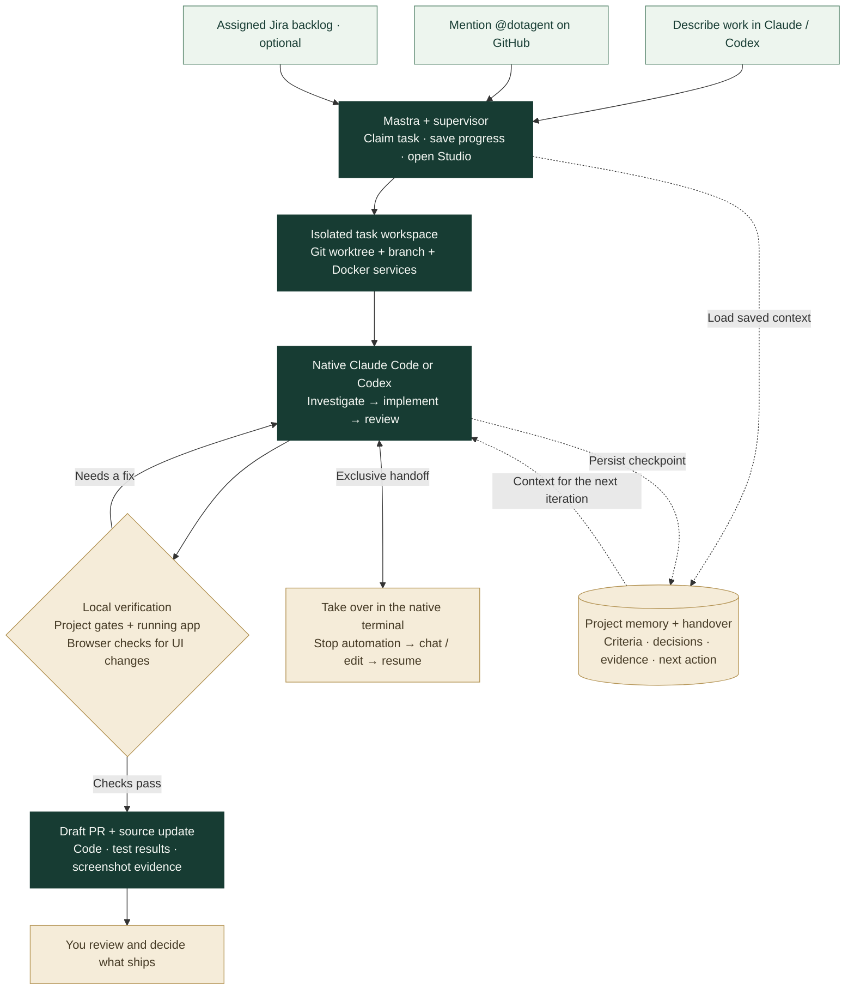

<div align="center">

# dotagent

### Put your coding agent to work. Stay in control.

A persistent engineering worker for **Claude Code** and **Codex**, orchestrated by **Mastra**.

[Get started](#get-started) · [How it works](#how-it-works) · [See the demo](#see-it-in-action) · [Technology stack](#technology-stack) · [User guide](docs/usage.md)


*Your tools. Your repositories. A workflow you can inspect and take over.*

</div>

Describe a task in your coding assistant—or mention `@dotagent` on GitHub—and let
your running machine carry the work through implementation, local verification
and draft-PR delivery. Come back to a visible worker terminal and a saved Mastra
run. Step into the native coding session whenever you need to steer.

**Early development · macOS first.** Codex execution and interactive resume have
been exercised locally. Interactive Claude takeover still needs live validation.
See [actual validation results and limitations](VALIDATION.md).

## Why developers use dotagent

| What you need | What dotagent does |
| --- | --- |
| Start work without a long setup conversation | Accepts natural-language requests through Claude/Codex skills, authorized GitHub mentions or optional Jira intake. |
| Keep work moving between sessions | Persists criteria, decisions, evidence and the next action; resumes interrupted work within configured limits. |
| Keep parallel tasks separate | Gives each task an owned worktree, branch, Compose project, ports and writable data. |
| Know what is happening | Opens Mastra Studio and a visible task terminal with progress and commands. |
| Step in when judgment matters | Stops task automation before opening the saved native host conversation; checks your changes when you return control. |
| Review evidence alongside code | Runs project gates and the application, captures relevant UI evidence and prepares a draft PR with testing instructions. |
| Build knowledge about each project | Retains sourced lessons and explicit guidance, with correction history and separate memory per repository. |

## How it works



[Download the workflow diagram](https://github.com/user-attachments/assets/288cb9e6-2b88-4958-be88-0fb93b5feb2c) for presentations or sharing.

A response ending does not finish the task. Failed checks send it back through the
engineering loop. Missing access or a product decision becomes a recorded blocker.
Completion requires verified criteria and delivery artifacts. You own the review;
dotagent does not automatically merge, deploy or publish packages.

## Get started

### 1. Install

You need **Python 3.11+**, **Node.js 22.13+**, Git, Docker Compose, authenticated
GitHub CLI (`gh`), and a locally authenticated Claude Code or Codex CLI. Codex must
support `--no-daemon`; the tested version is 0.160.1. Screenshot delivery requires
`gh pr edit --attach`. `dotagent doctor` checks installed capabilities.

```sh
git clone https://github.com/tawanorg/dotagent.git
cd dotagent
npm ci
npm run build
python3 dotagent/install.py
```

Add `~/.local/bin` to your PATH. The installer adds the host skills without replacing
unrelated configuration. Reload your coding assistant to discover them.

### 2. Configure your repository

Copy [the project template](dotagent/config.example.toml) to your repository's
`.dotagent.toml`, or register `~/.config/dotagent/projects/my-project.toml`.
Set the real repository path, GitHub repository, Compose services, verification
commands and Playwright location. The template contains placeholders to replace.

Each repository owns its backlog settings, task history, environments, Mastra runs
and memory. [Configuration and project selection →](docs/usage.md#one-project-one-brain)

### 3. Start your day

Open the interactive project picker:

```sh
dotagent
```

Use the on-screen keys to select a project/task, read live worker logs, start or
pause work, and open Studio, a worker or its PR. Opening the dashboard does not
start intake. `dotagent dashboard` is the explicit equivalent; CLI commands remain
available for scripts. [Dashboard controls →](docs/usage.md#terminal-dashboard)

Use `--host claude` for Claude Code. Startup opens the project's Mastra dashboard.
Start and instruct dotagent from your coding assistant as well:

```text
# Claude Code
/dotagent Add accessible Active and Done filters. Verify the app and open a draft PR.

# Codex: invoke the skill with $dotagent or select it in /skills
$dotagent Add accessible Active and Done filters. Verify the app and open a draft PR.
```

Keep talking: “show progress”, “preserve keyboard shortcuts”, or “remember this
approach for this project”. Task guidance and reusable project preferences are
stored separately. [Commands and controls →](docs/usage.md#tasks-and-instructions)

## Start work from your phone

On a configured GitHub issue or PR:

```text
@dotagent work on this issue
@dotagent fix this PR using the review context; preserve the existing API
```

Enable the project's mention listener and install its login service on your
always-on Mac. The worker polls GitHub through `gh`, accepts only authorized
senders and deduplicates requests. No public webhook endpoint is required.

Your Mac must be awake and connected. [Set up GitHub triggers →](docs/usage.md#trigger-your-mac-worker-from-github)

## Come back and take over

Each active task opens a visible macOS Terminal. **Enter or Ctrl-C** stops its
worker and opens the saved Claude/Codex conversation interactively. Other tasks
keep running. After you exit, the task stays held until you return it:

```sh
dotagent terminal TASK_ID          # Open the visible worker
dotagent takeover TASK_ID          # Take control in this terminal
dotagent resume TASK_ID            # Reconcile your edits and rerun verification
```

This uses supported session resume. If the task has no saved host conversation,
a new native session loads its handover. You can configure headless operation.

## See it in action

A small Todo app gives dotagent a real, observable change: add accessible All,
Active and Done filters without changing the existing persistence behavior.

[Example source](examples/todo/README.md) · [Real GitHub issue](https://github.com/tawanorg/dotagent-todo-demo/issues/1) · [Draft PR with evidence](https://github.com/tawanorg/dotagent-todo-demo/pull/2)

### From a request to a traceable run

The issue card below contains the actual issue and authorized mention, presented
as an API-backed evidence report. The Studio image is an actual workflow capture.

| 1. A real request | 2. A visible Mastra run |
| --- | --- |
|  |  |

### From baseline behavior to a tested change

| Before: all tasks, no filters | After: Active shows unfinished tasks |
| --- | --- |
|  |  |

Seven runtime checks passed, including browser verification. A draft PR exists
with uploaded screenshots; the saved task is still under human control, so final
automated delivery reconciliation is not claimed complete. Screenshot originals
stay outside Git. The banner is conceptual promotional artwork; the app and
Studio captures show the real demo.

## Technology stack

| Layer | Technology | Responsibility |
| --- | --- | --- |
| Orchestration | **TypeScript 6 + Mastra** | Persistent workflows, the engineering iteration loop, checkpoints and Studio. |
| Workflow storage | **LibSQL + Mastra Observability** | Saved runs, snapshots and traces. |
| Local runtime | **Python 3.11+**, standard library | CLI, process supervisor, resource ownership, integrations and recovery. |
| Operational state and memory | **SQLite** | Task claims, evidence, delivery receipts and sourced project knowledge with correction history. |
| Engineering execution | **Claude Code or Codex CLI** | Native model/tool execution, authentication and interactive session resume. |
| Workspace isolation | **Git worktrees + Docker Compose** | Per-task branches, services, ports and mutable data. |
| Browser verification | **Playwright / Chromium** | Actual application interaction, console/network checks, screenshots and image rendering checks. |
| Delivery and remote triggers | **GitHub CLI + GitHub API** | Issue/review intake, branches, PRs, attachments and idempotent updates. |
| Optional backlog integration | **Authenticated local Atlassian MCP** | Jira intake and progress updates through a configured native host. |
| Workflow validation | **Zod + Node.js tests + Python unittest** | Typed workflow contracts and regression checks. |

Exact dependency versions live in [package.json](package.json) and
[package-lock.json](package-lock.json). The Todo example uses dependency-free
Node.js, HTML, CSS and browser JavaScript.

Host integrations such as Serena, Context7, Firecrawl and Argent follow the
[canonical engineering playbook](dotagent/PLAYBOOK.md) when installed and relevant.
They are not separate orchestration runtimes. Project memory currently uses local
search and source history; **Hermes and a vector database are not integrated**.
Native CLI authentication stays with the host—dotagent does not turn subscription
credentials into API credentials.

## Built for inspectable work

- **Persistent, bounded execution.** Heartbeats, crash recovery, retry backoff and configurable time, iteration and resource limits.
- **Independent project ownership.** Each repository has its own state and brain; workers in that repository share its dashboard and project knowledge.
- **Configurable concurrency.** Start with one worker, then use `--workers N`. Each task keeps its own worktree and environment.
- **Evidence before completion.** Project gates, running-app verification and relevant UI screenshots remain required. Unavailable checks stay unverified.
- **Explicit human control.** A native human session excludes automated writers until you return the task.

## Development and current limits

```sh
npm run typecheck
npm test
python3 -m unittest discover -s tests -v
npm run build
```

The recorded implementation validation includes **52 Python tests and 3 Mastra
workflow tests**, plus a production build, native Codex resume and browser evidence.
See [validation](VALIDATION.md) for commands, receipts and unverified areas.

Claims are local to one machine. macOS login startup is implemented; always-on
Linux deployment uses a manually configured systemd service. A sleeping or powered-off
machine cannot execute. Codex subscription dollar usage may be unknown; hard USD
caps require cost-reporting hosts. Interactive Claude takeover and physical
sleep/reboot remain unverified. There is no automatic merge or deployment.

---

[User guide](docs/usage.md) · [Project template](dotagent/config.example.toml) · [Engineering playbook](dotagent/PLAYBOOK.md) · [Validation](VALIDATION.md) · [Integration research](CAPABILITIES.md)
